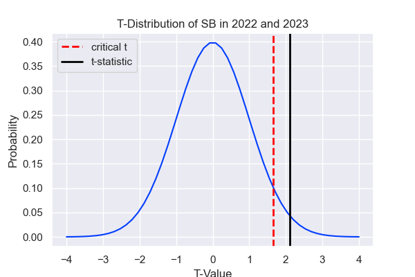
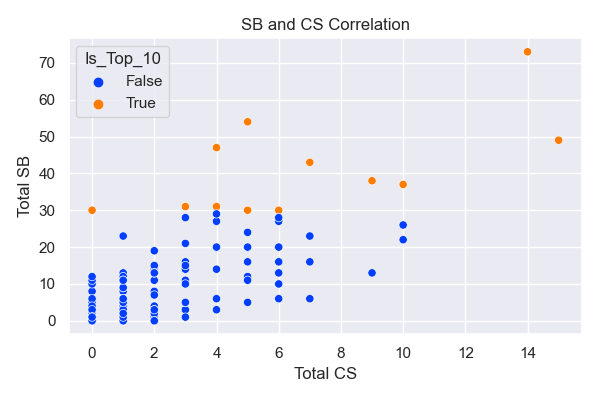
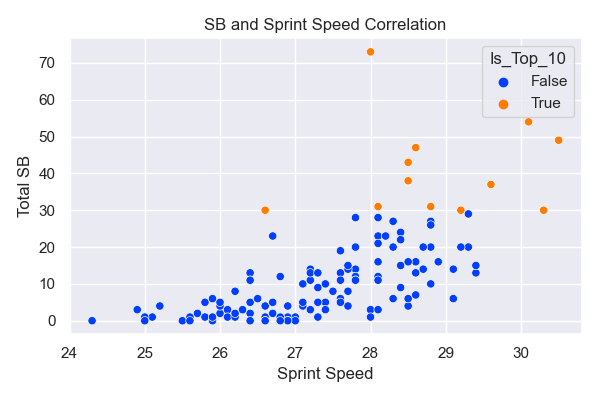
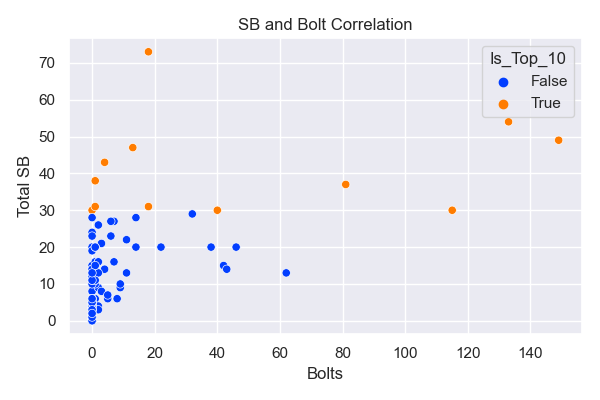
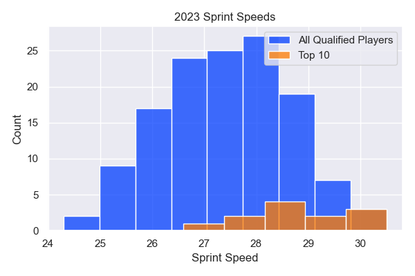

# Stolen Bases: A Matter of Skill or Guts?
Author: [Scarlett Valentin](https://www.linkedin.com/in/scarlett-valentin/)

# Business Understanding
MLB saw an increase in stolen bases in 2023. An MLB team wants to increase viewer retention rates and increase the fan base by adding more action into the game, and they've decided on joining the fun with stolen bases. In this project, I will be advising the MLB team on **how to increase SB stats** for their players. Is it a matter of skill or guts? While this MLB team wants to increase SB stats, they do not want it to jeopardize their wins.

I investigate the following questions:
1. Was the increase in stolen bases from 2022 to 2023 **significant**?
2. What contributes to a high number of **stolen bases**?

# Data Understanding
This data was extracted from a custom leaderboard I created on **Baseball Savant**. There are 2 datasets with the same format - [one from 2022](https://baseballsavant.mlb.com/leaderboard/custom?year=2022&type=batter&filter=&min=q&selections=r_total_caught_stealing%2Cr_total_stolen_base%2Cn_bolts%2Csprint_speed&chart=true&x=r_total_caught_stealing&y=r_total_caught_stealing&r=no&chartType=beeswarm&sort=r_total_stolen_base&sortDir=desc) and [one from 2023](https://baseballsavant.mlb.com/leaderboard/custom?year=2023&type=batter&filter=&min=q&selections=r_total_caught_stealing%2Cr_total_stolen_base%2Cn_bolts%2Csprint_speed&chart=true&x=r_total_caught_stealing&y=r_total_caught_stealing&r=no&chartType=beeswarm&sort=r_total_stolen_base&sortDir=desc). The data includes **CS** (caught stealing), **SB** (stolen base), **Bolts** and **Sprint Speed** from **players in the MLB** (Major League Baseball). The 2022 dataset has stats for 130 players and the 2023 dataset has stats for 133 players. This data has been collected from **Statcast**, "a state-of-the-art tracking technology, capable of measuring previously unquantifiable aspects of the game."([Baseball Savant](https://baseballsavant.mlb.com/about#:~:text=Where%20is%20the%20data%20from,probable%20pitchers%20for%20upcoming%20days.))

## Data Preparation
Since the data was extracted from a custom leaderboard I created on [Baseball Savant](https://baseballsavant.mlb.com/), there was minimal cleaning that needed to be done. I cleaned columns names and NaNs. I feature engineered three columns - Total_Steal_Attempts, Stolen_Base_%, and Is_Top_10, as well as created 2 more dataframes for analysis purposes.

# Exploratory Data Analysis
## 1. Was the increase in stolen bases from 2022 to 2023 significant?
I conducted a two sample t-test to determine if there was an increase in stolen bases from 2022 to 2023. 
With the following findings:
- t-statistic of approximately 2.1 and a critical t-value of 1.65
- alpha value of 5% and p-value of approximately 0.035
<br>

I **reject the null hypothesis** at a significance level of 5%.


## 2. What contributes to a high number of stolen bases?
The visualization below is a scatterplot that demonstrates the relationship between SB and CS. The players with the top 10 SB in 2023 are plotted in orange, while the remainder of the dataset is plotted in blue. `df_2023` has a **strong positive correlation** between these two variables, while `top_10_sb` has a **moderate positive correlation** between these two variables. <br>


The visualization below is a scatterplot that demonstrates the relationship between SB and Sprint Speed. The players with the top 10 SB in 2023 are plotted in orange, while the remainder of the dataset is plotted in blue. df_2023 has a **moderate positive correlation** between these two variables, while top_10_sb has **little to no correlation** between these two variables.


The visualization below is a scatterplot that demonstrates the relationship between SB and Bolts. The players with the top 10 SB in 2023 are plotted in orange, while the remainder of the dataset is plotted in blue. df_2023 has a **moderate positive correlation** between these two variables (which could be effected by the outliers), while top_10_sb has **little to no correlation** between these two variables.


The visualization below is a histogram that displays the spread of Sprint Speeds. This plot shows that the mean of the Sprint Speeds in `top_10_sb` is **greater** than the mean of `df_2023`. As we learned above, there is a moderate positive correlation between SB and Sprint Speed, which many would agree intuitively. However, there are clearly other factors at play here, as the **top SB does not necessarily produces by the fasted runners**.


The visualization below is a histogram that displays the spread of SB%. This plot shows that the mean of the SB% in `top_10_sb` is **greater** than the mean of `df_2023`. The plot of all qualified players in 2023 is **left-skewed**, which shows most players are over 50% SB%. This makes sense, as players would not want to risk SB at a 50% rate. This would be offering up outs to their opponents. This is an interesting take because it demonstrates that players with a large number of CS are still **greatly outweighing the risk** with a corresponding large number of SB.


# Conclusion

## Limitations
1. I used a rather **small dataset**. I analyzed the SB numbers based on the 2023 data, which has data from only 133 players.
2. This analysis does not consider the variety of **other factors** that go into the decision to steal a base or to not steal a base (ie. pitcher handedness, catcher's arm strength, ability to pick up on defensive team's signals, etc.) Some players have better opportunities to steal than others.

## Recommendations
1. The MLB is seeing a significant increase in SB and we want to be a part of it. We should **proceed with our plan to increase SB**, as it seems like a worthwhile risk.
2. Choose the players with **top Sprint Speeds** (but not necessarily Bolts) to focus on increasing SB attempts. While this seems intuitive, these players will have to **increase their ability to take risks**. This comes easier to some personality traits than others, so the coach will have to drill stolen base practice and expect caught stealing to increase. The goal is to retain more viewers and attract more fans by increasing the action in the game, therefore, this is a risk we can be willing to take.

## Next Steps
1. I would like to **repeat this analysis** with a **larger dataset**, using all time data available. This would include analyzing SB over all the years and digging into increases and decreases. This also would include comparing stats from players with top SB over all the years to investigate any trends. I believe this could give me further insight into SB statistics.
2. I would like to analyze how SB, CS, and SB% effects the number of **wins for a baseball team**. Narrowly focusing on stolen bases to increase viewer retention could result in a great increase in losses, thus decreasing viewer retention - which is the exact opposite of our goal. This cannot be done carelessly, so I would like to determine a threshold that will hold a good balance for increasing action but not severely jeopardizing the game.

# For More Information
See the full analysis in the [Jupyter Notebook](/notebook.ipynb/), review this presentation, or review the [interactive dashboard](https://public.tableau.com/views/mlb_stats_17110786025420/MLB22-23Stats?:language=en-US&publish=yes&:sid=&:display_count=n&:origin=viz_share_link).

You can contact me on [LinkedIn](https://www.linkedin.com/in/scarlett-valentin/).

# Repository Structure
```
├── images
├── README.md
├── mlb_presentation.pdf
└── notebook.ipynb
```